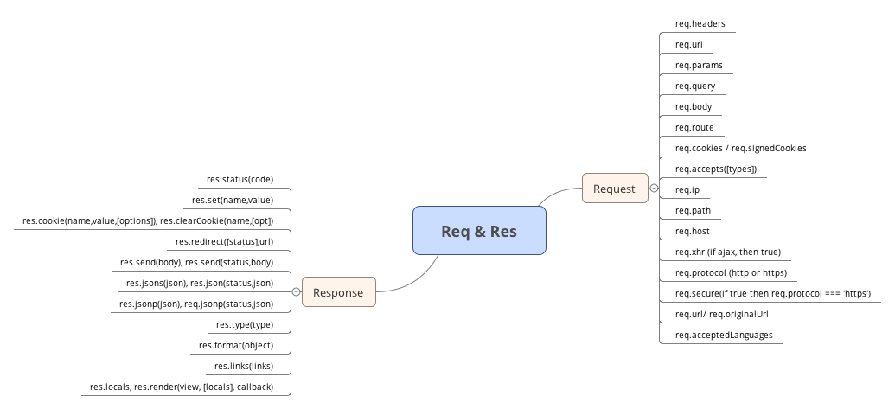

#Request :
	voir requset_header.js

#Response : 
	pour une raison de sécurité, il ne faut pas fournir les information du serveur, les ressouces doivent être abstracts. 
	et aussi disablt X-power-By

~~~js
app.disable('x-powered-by');
~~~

## MIME
voir [MIME](http://www.iana.org/protocols)
ajax peut utiliser **application/json**

# RESUME

